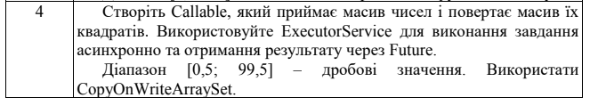
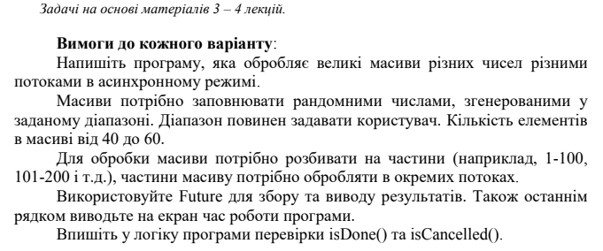

# PracticeWork2





## Пояснення алгоритму

Програма генерує масив випадкових значень типу `Double`, ділить його на частини, обробляє кожну частину паралельно для піднесення елементів до степеня.


- **`getRandomArray()`**: Створює масив випадкового розміру (40-60) з значеннями в діапазоні 0.5-99.5.

- **`splitArray()`**: Ділить масив на задану кількість частин (в даному випадку 2).

З частин масиву заповнюю масив "рахувальників", потім додаю завдання для `ExecutorService`:

```java
for (SquareArray counter : counterList) {
    futures.add(es.submit(counter));
}
```
Рахуючи різніцю часових міток виводжу час виконання в секундах:
```java
// START TIME MARK
long startTime = System.currentTimeMillis();
. . .
// END TIME MARK
long endTime = System.currentTimeMillis();
double elapsedTime = (endTime - startTime) / 1000.0;
System.out.println("Time in seconds : " + elapsedTime);
```

>Також через можливість дублікатів шукаю та виводжу масив з ними
> duplicates = [...]


